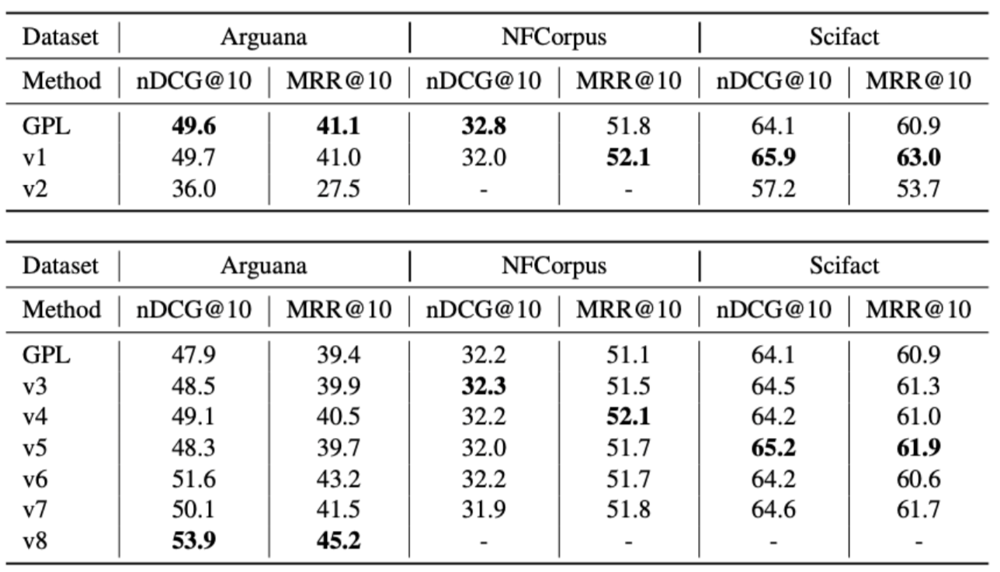

# tripleR

This is a repository for tripleR: Recontextualize, Revise and Retrieve, final project for SNU 23 Spring Natural Lanugage Processing.

This project is based on [GPL: Generative Pseudo Labeling](https://github.com/UKPLab/gpl) (NAACL 2022).

You can also refer to [presentation slide](assets/tripleR.pdf) for details.

Our contributions are as follows:

1. We address the problem of LM based-retrieval, generating pseudo-documents containing errors.

2. We hypothesize that revising the pseudo-document thoroughly with the original document will enhance the retrieval performance.

3. We propose tripleR, novel methods on recontextualizing and revising for dense retrieval.

4. We conduct extensive experiments and achieved better performance than the original paper


## Installation
One can install necessary packages via `git clone`
```bash
git clone https://github.com/lilys012/tripleR.git && cd tripleR
pip install -e .
```
> Meanwhile, please make sure the [correct version of PyTorch](https://pytorch.org/get-started/locally/) has been installed according to your CUDA version.

## Dataset
tripleR accepts data in the [BeIR](https://github.com/beir-cellar/beir.git)-format. Please make sure the dataset is in `tripleR/dataset` directory. 

Or else, you can modify `evaluation_output` argument below.

## Usage
We offer three datasets currently, which are `arguana`, `nfcorpus` and `scifact`.

One can run our code using the command below.
```bash
python tripleR.py \
    --dataset "arguana" \
    --method 0
```

We currently offer 8 methods including the modified default GPL, but 13 methods were initially sketched.

Integers mapped to each method are as below.
```
methods

0 : default
1 : generate pseudo-document w/ flan-t5-xl and task-specific prompt
2 : pseudo-document is revised w/ flan-t5-xl based on doc
3 : erase pseudo-document based on confidence
4 : [MASK] random 1 + put to distilbert-base-uncased {pseudo-doc [SEP] doc} to revise
5 : [MASK] pseudo-document based on confidence + put to distilbert-base-uncased {pseudo-doc [SEP] doc} to revise 
6 : concatenate v3 with generated query 
7 : concatenate v5 with generated query 

-- not implemented --
8 : revise v3 with flan-t5-xl
9 : generate pseudo-document w/ flan-t5-xl and one-shot example
10 : [MASK] pseudo-document based on confidence + put to decoder {prompt, pseudo-doc, doc} to revise (X)
11 : [MASK] pseudo-document based on confidence + retrieve relevant docs to revise
12 : generate queries in style of msmarco queries (distribution, few-shot, etc..)
```
While method 2 and 4 are implemented in [data_loader.py](gpl/data_loader.py), method 1, 3, 5~8 are implemented in [auto_model.py](gpl/toolkit/auto_model.py). Also, [train.py](gpl/train.py) is modified from original GPL code.

## Modification
We slightly modified training config of GPL due to limitation of resources. 

We decreased the training step from 140K to 70K and changed `|corpus size| x queries per passage` from 250K to 100K. Furthermore, we didn't use TSDAE nor TAS-B methods.

## Results
We report our experiment results below.

We note that v1 and v2 for nfcorpus and arguana were conducted with the original GPL training settings.


